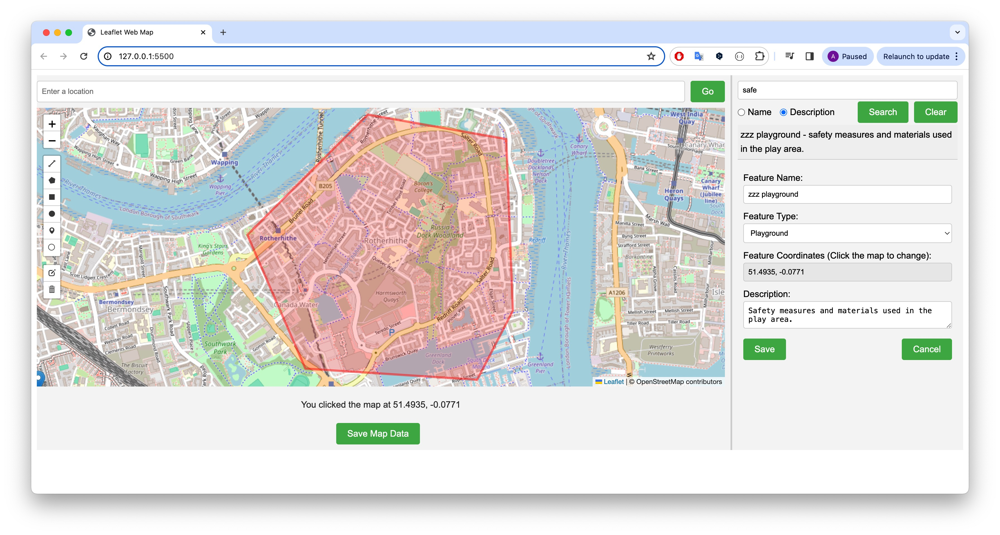
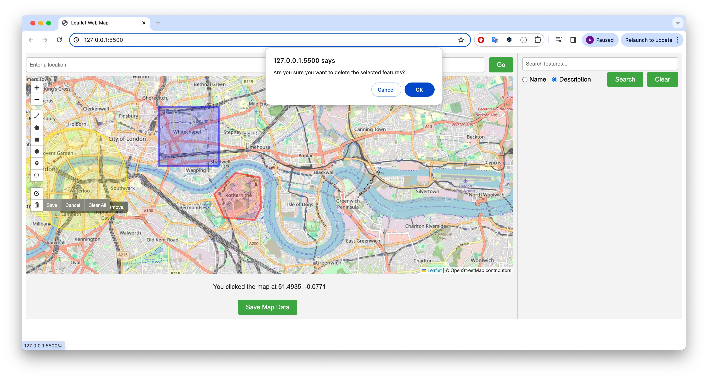
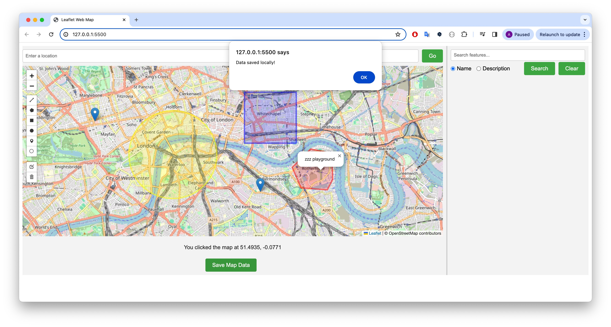

# UrbanFeedbackMap

## Project Overview
UrbanFeedbackMap is an extension of the LeafletWebMap project, adapted for urban planning and public feedback integration. This interactive web mapping application developed using Leaflet.js enables users to associate multiple features with text blocks and vice versa, enhancing community engagement and urban development feedback.

## Features
- **Enhanced Interaction**: Users can associate multiple geographical features with text descriptions and vice versa.
- **Dynamic Map Viewing**: Supports panning and zooming within the map to explore urban areas.
- **Advanced Feature Management**: Users can add, edit, or delete points, lines, or areas and associate them with descriptive text blocks.
- **Robust Search Functionality**: Enhanced to search by names or descriptions and view results interactively.
- **Local Storage**: Supports saving map data locally to ensure data persistence across sessions.
- **Responsive Design**: Ensures usability on various devices by adapting to different screen sizes.

## Technologies Used
- **Leaflet.js**: A leading open-source JavaScript library for mobile-friendly interactive maps.
- **HTML5**, **CSS3**, and **JavaScript**

## Setup and Installation
1. **Clone the Repository**
   ```bash
   git clone https://github.com/yourusername/urban_feedback_map.git

2. **Navigate to the project directory**
   ```bash
   cd urban_feedback_map
   ```
3. **Open `index.html` in your browser**
   Open the file in your web browser to start using the application.

## Usage
Interact with the map through intuitive controls to add, modify, or associate features and text. Use the search functionality to find specific entries and make changes as needed.

## Contributing
Contributions are welcome! Feel free to fork the repository, make changes, and submit pull requests. For major changes, please open an issue first to discuss what you would like to change.

## License
This project is licensed under the MIT License - see the [LICENSE.md](LICENSE) file for details.

## Acknowledgments
- Thanks to the Leaflet.js team for the foundational mapping tools.
- [OpenStreetMap](https://www.openstreetmap.org/) for providing free map tiles.

🌱🌱🌱
# Quick Guide for UrbanFeedbackMap

Welcome to UrbanFeedbackMap! This quick guide will help you familiarize yourself with the application's features and functionalities, allowing you to efficiently utilize the map for urban planning and public feedback.

## Getting Started

### Opening the Application
- Navigate to the folder where you have saved UrbanFeedbackMap.
- Open the `index.html` file in a web browser of your choice.

### Interface Overview
- **Map Area**: The central part of the application where you can view and interact with the map.
- **Location Form**: At the top of the map, allows you to enter a location to zoom into.
- **Search Form**: Located in the sidebar, use this to search for features by name or description.
- **Feature Control**: Use the drawing tools to add new points, lines, or areas and link them to descriptions.
- **Save Button**: Located below the map, use this to save your current map data locally.

  
*Figure 1: Overview of the Map Area*

## Basic Operations

### Adding a Feature
1. Select the appropriate drawing tool from the control options on the map.
2. Click on the map where you want to place the feature.
3. Use the feature form that appears to enter a name, select a type, provide coordinates, and a description. Click "Save" to add the feature to the map.

  
*Figure 2: Adding a new feature to the map*

### Editing a Feature
1. Use the search form to enter the description of the feature you are looking for.
2. Click "Search" to display a list of matching features in the sidebar.
3. Select the feature you want to edit from the list to automatically open the feature form with its details filled in.
4. Modify the feature’s details in the form. You can change the name, type, coordinates (if applicable), and description.
5. Click "Save" to apply the changes to the feature on the map.

  
*Figure 3: Editing an existing feature through the search function*

### Editing a Feature Using the Leaflet Draw Tool
1. Click the "Edit layers" button in the map's drawing controls to start editing features.
2. Select the feature you want to edit directly on the map.
3. Modify the feature's position or shape as needed.
4. To update details like name, type, or description, ensure the feature is selected, then use the sidebar form to make changes and click "Save".

  
*Figure 4: Editing a feature using the Leaflet draw tool*

### Deleting a Feature Using the Leaflet Draw Tool
1. Click the "Delete layers" button in the map's drawing controls to start deleting features.
2. Select the feature you wish to delete.
3. Press the save button in the drawing control toolbar or use the delete option that appears after selecting the feature.

  
*Figure 5: Deleting a feature using the Leaflet draw tool*

These instructions ensure that users are aware of how to interact with the map features directly using Leaflet's built-in tools for a more dynamic experience. Including screenshots for each step helps visually guide the user through the process, making it easier to understand.


### Searching for a Feature
**By Description: **
1. Simply enter a keyword into the search box located in the sidebar.
2. Click "Search" to find and display matching features. If the search box is left blank, all features will be listed as results in the sidebar.
3. Click on a feature's name in the results to highlight and zoom into the selected feature on the map and view or edit its details in the sidebar form.

**By Name: **
If you search by name, the map will zoom directly to the feature that matches the name you've entered. This is useful for quickly locating a specific feature on the map.

  
*Figure 6: Using the search function to find features*

This functionality enhances user interaction by allowing not only targeted searches but also providing an overview of all features when no specific query is entered. The sidebar effectively serves as a dynamic legend or directory of map content, which can be particularly useful in urban planning contexts where understanding the entire landscape is beneficial.

### Saving Your Map Data
- Click the "Save Map Data" button below the map to save all current features and their details to your local storage.

  
*Figure 7: Saving map data locally*

## Tips
- Zoom in or out on the map for better precision while adding or editing features.
- Regularly save your data to ensure no progress is lost.

## Need Help?
For assistance or more information, refer to the full documentation, or contact support via email at support@example.com.

We hope you enjoy using UrbanFeedbackMap to engage with urban spaces and gather valuable community insights!


