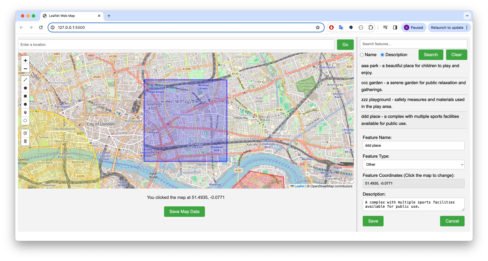

# LeafletWebMap

## Project Overview
LeafletWebMap is an interactive web mapping application developed using Leaflet.js. It allows users to view a map, add and edit custom geographical features, and search through these features based on their descriptions. The application is designed to be responsive, making it accessible on a variety of devices.

## Features
- **Dynamic Map Viewing**: Users can pan and zoom within the map to explore different regions.
- **Feature Addition**: Users can add points, lines, or areas to the map.
- **Feature Modification**: Existing map features can be edited or deleted.
- **Search Functionality**: Users can search for features by their descriptive text.
- **Local Storage**: Map data can be saved locally in the browser, allowing users to retain their changes.
- **Responsive Design**: The application adapts to different screen sizes, ensuring usability across devices.

## Technologies Used
- **Leaflet.js**: An open-source JavaScript library for mobile-friendly interactive maps.
- **HTML5**
- **CSS3**
- **JavaScript**

## Setup and Installation
1. **Clone the Repository**
   ```bash
   git clone https://github.com/AtsukoKuwahara/LeafletWebMap.git
   ```
2. **Navigate to the project directory**
   ```bash
   cd LeafletWebMap
   ```
3. **Open `index.html` in your browser**
   Simply double-click on `index.html` to open it in your default web browser, or drag and drop the file into the browser window.

## Usage
To use the application, simply interact with the map through the provided controls:
- Use the draw control to add new features.
- Select any feature to view its details and edit or delete it.
- Use the search bar to find features by their descriptions.
- Click the "Save Map Data" button to save your map data locally.

## Contributing
Contributions to LeafletWebMap are welcome! If you have suggestions for improvements or bug fixes, please open an issue or submit a pull request.

## License
This project is licensed under the MIT License - see the [LICENSE.md](LICENSE) file for details.

## Acknowledgments
- Leaflet.js Team for providing an excellent mapping tool.
- [OpenStreetMap](https://www.openstreetmap.org/) for the free map tiles used in this project.

🌱 🌱 🌱
# Quick Guide for LeafletWebMap

Welcome to the LeafletWebMap! This quick guide will walk you through the basic features and functionalities of the application to get you started on exploring and interacting with the map.

## Getting Started

### Opening the Application
- Navigate to the folder where you have saved LeafletWebMap.
- Open the `index.html` file in a web browser of your choice.

### Interface Overview
- **Map Area**: The central part of the application where you can view and interact with the map.
- **Location Form**: At the top of the map, allows you to enter a location to zoom into.
- **Search Form**: Located in the sidebar, use this to search for features by their descriptions.
- **Feature Control**: Use the drawing tools to add new points, lines, or areas.
- **Save Button**: Located below the map, use this to save your current map data locally.

  
*Figure 1: Overview of the Map Area*

## Basic Operations

### Adding a Feature
1. Select the appropriate drawing tool from the control options on the map.
2. Click on the map where you want to place the feature.
3. Enter a description for the feature in the popup text form that appears and click "Save Text".

  
*Figure 2: Adding a new feature to the map*

### Editing a Feature
1. Click on an existing feature.
2. Click "Edit layers" button to start modifying the feature's position or shape.
3. Modify the feature as needed.
4. Click on the feature again if you wish to update the description, then adjust the text and click "Save Text".

  
*Figure 3: Editing an existing feature*

### Deleting a Feature
1. Click on the "Edit layers" button.
2. Select the feature you want to delete and use the delete option that appears in the control.

  
*Figure 4: Deleting a feature*

### Searching for a Feature
1. Enter the description of the feature in the search box located in the sidebar.
2. Click "Search" to highlight and zoom into features that match your search criteria.

  
*Figure 5: Using the search function to find features*

### Saving Your Map Data
- Click the "Save Map Data" button below the map to save all current features and their descriptions to your local storage.

  
*Figure 6: Small Screen UI*

## Tips
- Zoom in or out of the map for better precision while adding or editing features.
- Regularly save your data to avoid losing changes.

## Need Help?
If you encounter any issues or have questions, refer to the detailed documentation, or contact support via email at support@example.com.

We hope you enjoy using LeafletWebMap to explore and customize your maps!
